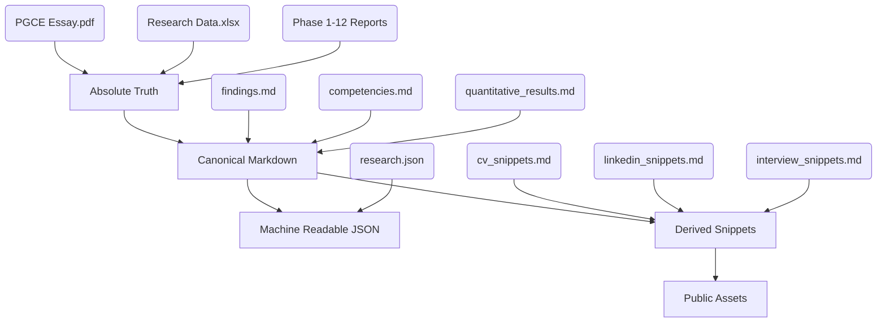
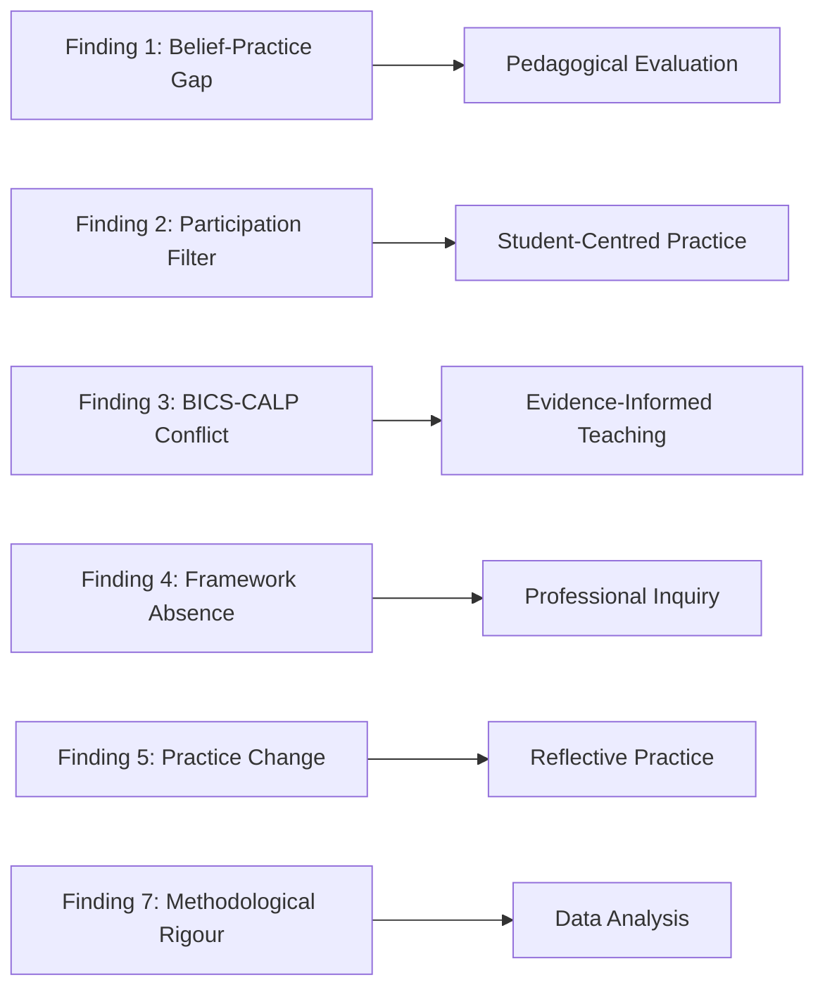
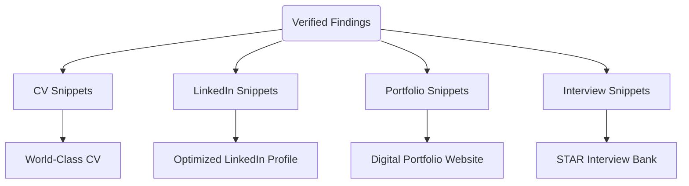

# Knowledge Graph - PGCE7002 Practitioner Research

This document illustrates the structural relationships between the raw evidence, the canonical research library, and the public assets generated for the portfolio.

## 1. Evidence Hierarchy

## 2. Research Findings to Competencies

## 3. Public Asset Generation

